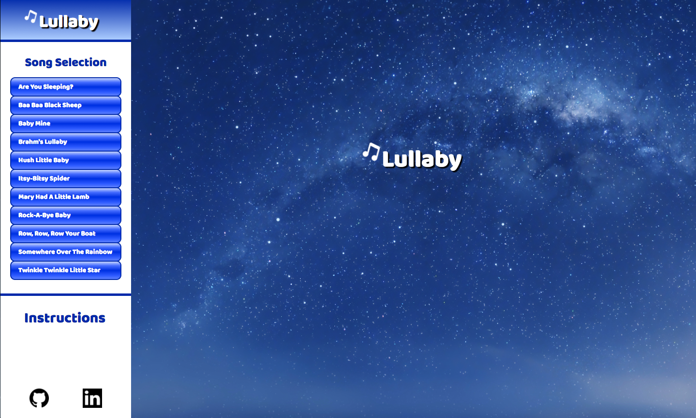

[Lullaby](https://miriam-lau.github.io/Javascript-Project/) is a personal project by Meiyen Lau.

Lullaby is an interactive music site where users can play popular
lullaby tunes using the computer keyboard.




## Instructions
1. Choose a song you would like to play on the left side-bar.
2. Follow the computer keys on the display to play the lullaby song.
3. Choose a different song by clicking on another selection.
4. Choose free-style play by closing the song page.  


## Features
- Users can freestyle play and press keyboard keys to play piano notes.
- Users can choose from a collection of songs to play.
- Each song will have a song page showing the sequence of computer keys to play the chosen song.
- Each key press will trigger several star burst animations shown randomly on the screen.


## Project Design
A [proposal](./docs/proposal/development_README.md) was drafted with an implementation timeline
during the development process.


## Technology
Lullaby is a website created using JavaScript, HTML and CSS. Additional frontend technologies include:
- Buzz: A JavaScript library for playing sounds on the website.
- Anime.js: Animations were created using anime.js and the star burst was modified from Alex Zaworski. Animations were created from a collection of circles,
randomized by color and position. The collection of circles were saved in
an array, and anime.js was used to create the effect of movement for a
set time interval before removing the animation.

```js
let particles = [];
for (let i = 0; i < 32; i++) {
  let particle = new Circle({
    x: xCoord,
    y: yCoord,
    fill: color[Math.floor(Math.random() * 3)],
    r: anime.random(1, 5)
  })
  particles.push(particle);
}
```

- Sound Fonts: Grand piano music notes were created by jobro (www.freesound.org).
- Youtube: Source for song notes.


## Future Implementations
New features and future implementations are listed in this
[outline](./docs/future_implementations.md).
