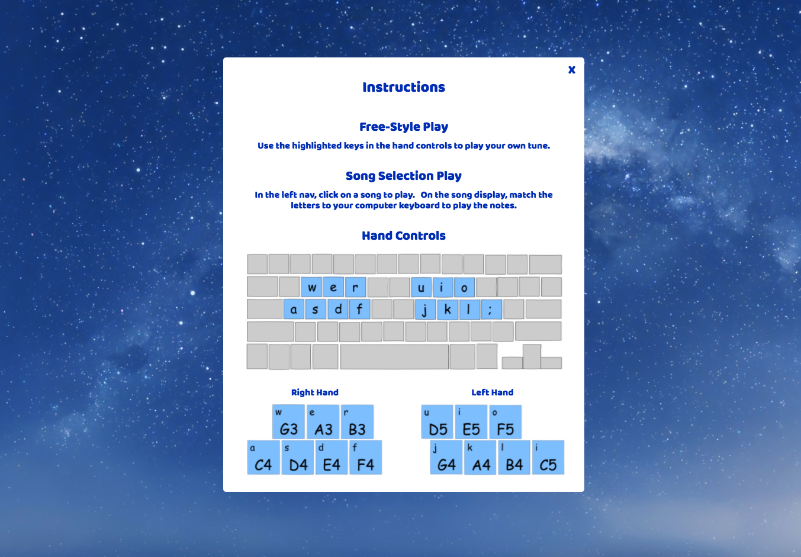

[Lullaby](https://miriam-lau.github.io/Javascript-Project/) is a personal project by Meiyen Lau.

Lullaby is an interactive music site where users can play popular
lullaby tunes using the computer keyboard.


## Instructions
1. Choose a song you would like to play on the left side-bar.
2. Follow the computer keys on the display to play the lullaby song.
3. Choose a different song by clicking on another selection.
4. Choose free-style play by closing the song page.  




## Features
- Users can freestyle play and press keyboard keys to play piano notes.
- Users can choose from a collection of songs to play.
- Each song will have a song page showing the sequence of computer keys to play the chosen song. Upon song selection, the song display appears to guide the user to play the song.
- Each key press will trigger several star burst animations shown randomly on the screen.


## Project Design
A [proposal](./docs/proposal/development_README.md) was drafted with an implementation timeline
during the development process.


## Technology
Lullaby is a website created using JavaScript, HTML and CSS. Additional frontend technologies include:
- Sounds: To create sounds, Buzz JavaScript library was used for playing sounds on the website, and sound fonts of grand piano music notes were from by jobro (www.freesound.org). Computer keys were mapped to each sound font and upon a keydown event, the Buzz library played the associated sound font.

```js
$(document).keydown( function(event) {
  let key = event.originalEvent.keyCode;
  if (sounds.has(key)) {
    let sound = sounds.get(key);
    let soundPlay = new buzz.sound(sound);
    soundPlay.play();
  }
});
```

- Anime.js: Animations were created using anime.js and the star burst was modified from Alex Zaworski's animation. Each star burst was created from a collection of circles, randomized by color and position within a fixed radius. The collection of circles were saved in an array, and anime.js was used to simulate the effect of movement for a set time interval before removing the animation.

```js
let particles = [];
for (let i = 0; i < 32; i++) {
  let particle = new Circle({
    x: xCoord,
    y: yCoord,
    fill: color[Math.floor(Math.random() * 3)],
    r: anime.random(1, 5)
  })
  particles.push(particle);
}
```


- Youtube: Source for song notes. Songs were saved as lines in a nested array, and each line contains a series of notes mapped to computer keys.


## Future Implementations
New features and future implementations are listed in this
[outline](./docs/future_implementations.md).
