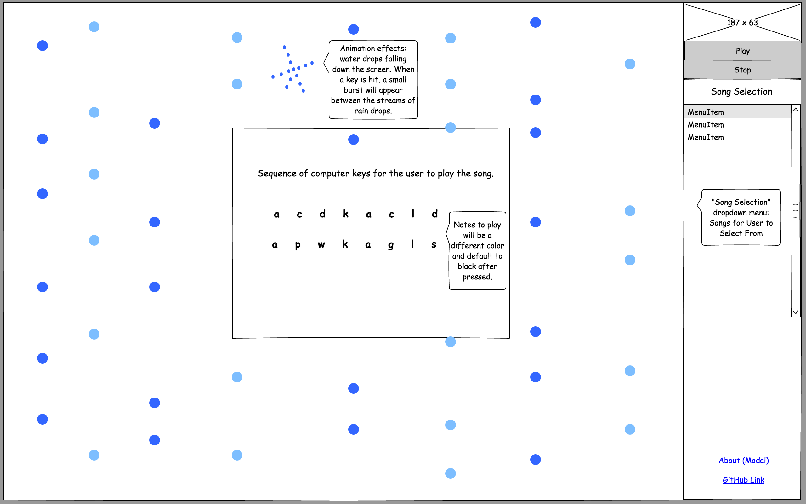

# Lullaby

## Background
Lullaby is an interactive site where users can play lullaby tunes using
the keyboard.

Each key on the computer keyboard will correspond to a distinctive
note on the piano. By pressing the correct keys listed, a user can
play a selected lullaby song.

## Functionality and MVP
- Play controls: Play controls will have computer keys linked to distinct piano notes.
Users can press keyboard keys to play piano notes.
- Seed songs: Site will have a selection of lullaby songs for the user to choose.
Selected song will be displayed on the screen with the sequence of key
presses for the user to play the song.
- User can start and stop the song.

## Wireframes
The site will be a single screen.
- Side bar: Users can hit play and stop. Users can select a song. Links
to About (modal) and Github.
- Main screen: Once a song is selected, the song keys will be displayed
on the screen for the user to follow. The main screen will have falling
dots, and when a key is pressed, little star bursts will be interspersed
between the falling dots.

## Architecture and Technologies
This project will include the following technologies:
- Overall structure and game logic: Vanilla JavaScript and jquery
- Piano key sounds: midi.js
- DOM manipulation and rendering: HTML5 and Canvas
- Small animation effects: anime.js
- Module bundler: webpack

This project will include the following scripts:
- main.js: this script will initiate a new play session and handle the logic for rendering elements in the DOM.
- keys.js: this script will link all the keys to piano notes.
- songs.js: this script will contain the songs mapped to the keys.

## Implementation Timeline
Day 1: Setup
Install Node modules, setup up webpack, and install technologies. Create webpack.config.js as well as package.json. Write a basic entry file and create a skeleton for all Javascript files. Learn how to use midi.js.

Day 2: Learn how to use midi.js
Implement simulation of keys to music notes. Map common lullaby songs to keys.

Day 3: User controls
Create controls for the user to interact with the site. Learn to use anime.js

Day 4: Frontend styling
Style the game, and add in animations with anime.js.
