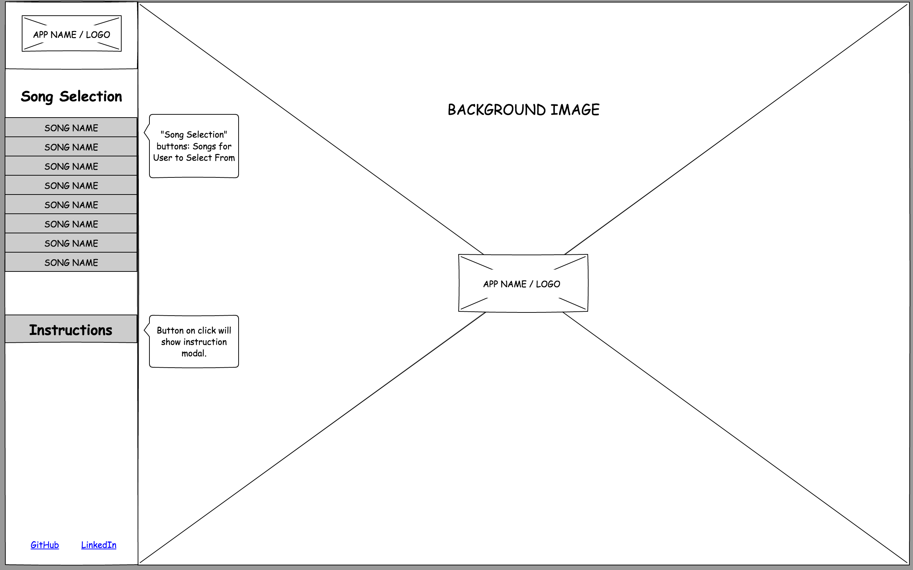

# Development of *Lullaby*

## Summary
*Lullaby* is an interactive site where users can play popular children's songs using the computer keyboard.

## Functionality

#### Player Controls
- A set of keys on the computer keyboard will correspond to a distinctive note on a grand piano. By pressing the correct keys listed, a user can play a selected lullaby song.
- Seven notes each will be mapped to the right and left hand.

#### Song Selection
- User can choose from a selection of lullaby songs in the side bar.
- The selected song will be displayed on the screen with the sequence of keyboard letters for the user to play the song.

## Wireframes

#### Main Screen
- The screen is divided into the side bar and the game display.
- The backdrop for the game display will be a night sky with stars, with the game logo in the center.  
- Users can select a songs to play in the side bar.

#### Song Display
- Once a song is selected, the song page will be displayed on the screen. The song notes are displayed as keyboard letters, and the user presses the corresponding letters to play the songs.
- When a key is pressed, little star burst animations will be randomly generated on the screen.

#### Instructions
- A user guide on how to select songs and play the game.
- Hand controls show the user where to position their hands.

## Architecture and Technologies

#### Technologies
- Vanilla *JavaScript* and *jquery* for game logic.
- [*Buzz*](https://buzz.jaysalvat.com/) JavaScript* library for integrating audio and sound fonts from [*jobro*](www.freesound.org) to simulate piano note sounds.
- *HTML5* and *Canvas* were used for game display and website design.
- [*anime.js*](http://animejs.com/) was used to create the star burst animations.
- *Webpack* is an open-source *JavaScript* module bundler that generates static assets for modules with dependencies. *Webpack* requires *Node.js*.

#### Scripts
- *lullaby.js* initiates a new play session and handles the logic for rendering elements in the DOM, and will create small animations that will show on the screen when a user presses a computer key.
- *display.js* shows the display screen the user will interact with to play a song.
- *keys.js* maps the piano key sounds to computer keys.
- *songs.js* contains the songs mapped to the computer keys, and after song selection, will display the notes on the display.

## MVP Checklist and Implementation Timeline

#### Day 1
- Install Node modules, setup up *Webpack* and install technologies.
- Create framework and write a basic entry file and create a skeleton for all *Javascript* files.

#### Day 2
- Implement simulation of keys to music notes. Map common lullaby songs to keys.
- Create controls for the user to interact with the site.

#### Day 3
- Finish testing UX for user controls. Learn to use *anime.js*.

#### Day 4
- Add *CSS* styling to the game and add in animations.
